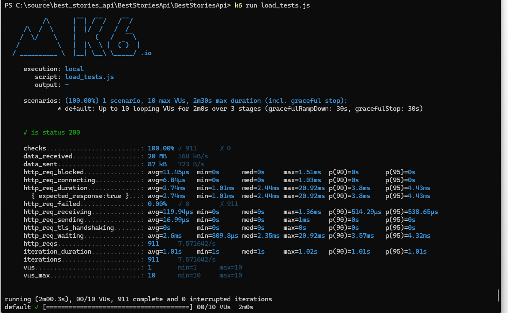

# Solution description
Based on requirements that it's not possible to overload Hacker News API and it should me as performed as possible and how api is created(
need to get array of ids and that for every id's ask for detail information for each stories). If we assume that it will be ok to not show 
this statistics in real time and for example delay can be some reasonable time we can build it in this way:  

Need to create background service that will request from Hacker News API (as i know max value of top stories is 500 (from documentation) and in general top  is constant value) that will return all top news for current moment . The Service need to build  data structures for redis cache (i will show example on number to make it simple ): 
 [1,2,3,4,5] than for redis cache if would be 
key  value
1    [1]
2    [1,2]
3    [1,2,3]
where  key is top value and value is json representation of needed result. 

In this case our APi would be more less gateway  with single responsibility just based on requested top value return proper value from redis cache without any data transformation and external calls. 
Performance and memory allocations for our service would be minimal. And if we want to scale out web api we need to move our background service into own app. 
Also if we use use Redis Sentinel cluster with one primary and multiple readonly nodes for scaling performance if it would be needed in future . 

For simplify development , to run it locally just run web api project and run in terminal : 
docker run --rm -p 6379:6379 redis:alpine

For run load test need to be in project folder and then run (before need to install https://grafana.com/docs/k6/latest/testing-guides/injecting-faults-with-xk6-disruptor/installation/) :
 k6 run load_tests.js

 test results on my machine  also no thread starvation and low memory usage and cs pleasure :

 